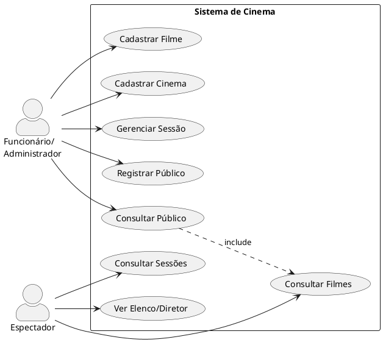

# Diagrama de Casos de Uso

## Atores

- **Funcionário/Administrador** — responsável pela gestão do sistema
- **Espectador** — acesso somente leitura a filmes e sessões

## Diagrama

> Renderize em [PlantUML Online](https://www.plantuml.com/plantuml/uml/) ou instale a extensão PlantUML no VS Code.

## Descrição dos Casos de Uso

| ID  | Nome | Ator | Descrição |
|-----|------|------|-----------|
| UC1 | Cadastrar Filme | Funcionário | Registra novo filme com todos os dados |
| UC2 | Cadastrar Cinema | Funcionário | Registra unidade da rede com endereço e capacidade |
| UC3 | Gerenciar Sessão | Funcionário | Cria sessão validando conflito de horário |
| UC4 | Registrar Público | Funcionário | Lança público diário de uma sessão |
| UC5 | Consultar Público | Funcionário | Totaliza público por sessão, filme ou cinema |
| UC6 | Consultar Filmes | Espectador | Lista filmes em cartaz |
| UC7 | Consultar Sessões | Espectador | Lista sessões por cinema |
| UC8 | Ver Elenco/Diretor | Espectador | Exibe detalhes do filme |
