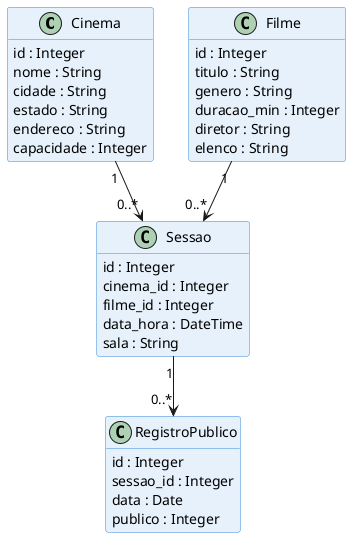

# Diagrama de Classes do Domínio

> Renderize em [PlantUML Online](https://www.plantuml.com/plantuml/uml/).

## Descrição das Entidades

| Entidade | Responsabilidade |
|----------|-----------------|
| `Cinema` | Representa uma unidade física da rede |
| `Filme` | Representa um filme com seus metadados |
| `Sessao` | Elo entre cinema e filme em data/hora/sala específicos |
| `RegistroPublico` | Registro diário de espectadores por sessão |
