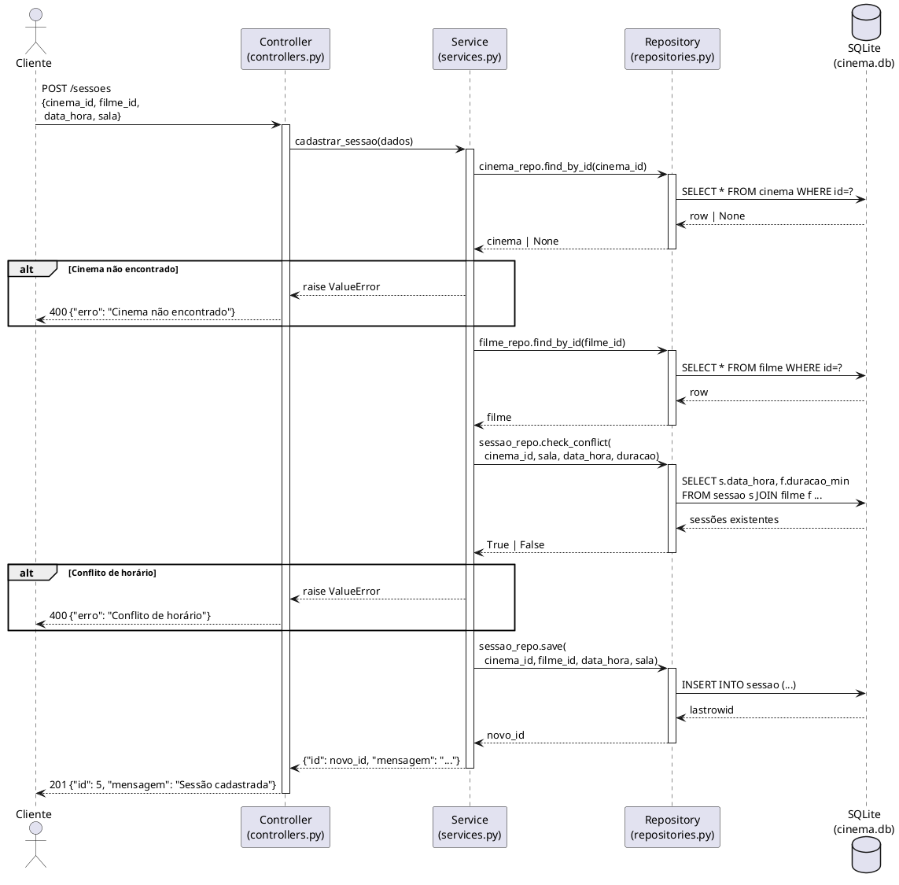
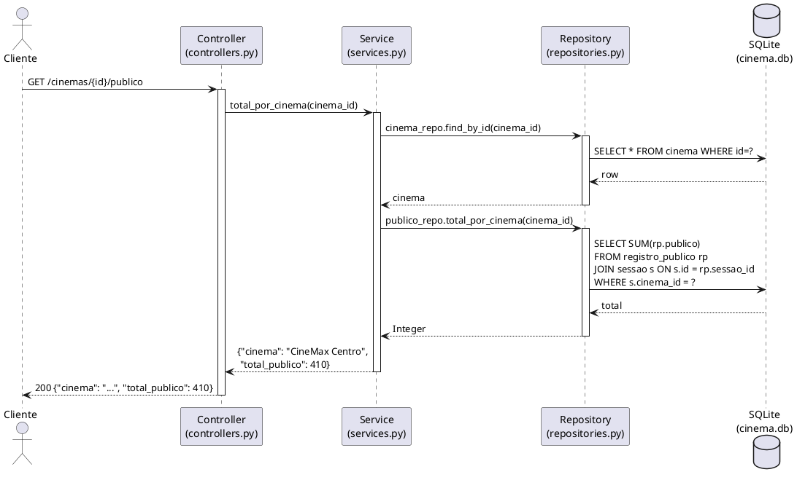

# Diagramas de Sequência

Os diagramas mostram a interação entre as camadas da arquitetura MVC:
**Controller → Service → Repository → SQLite**.

---

## DS01 – Cadastrar Sessão

Fluxo completo desde a requisição HTTP até a persistência, incluindo os caminhos de erro.

---

## DS02 – Consultar Público por Cinema

Fluxo de leitura mostrando como a agregação SQL percorre as camadas até retornar ao cliente.

