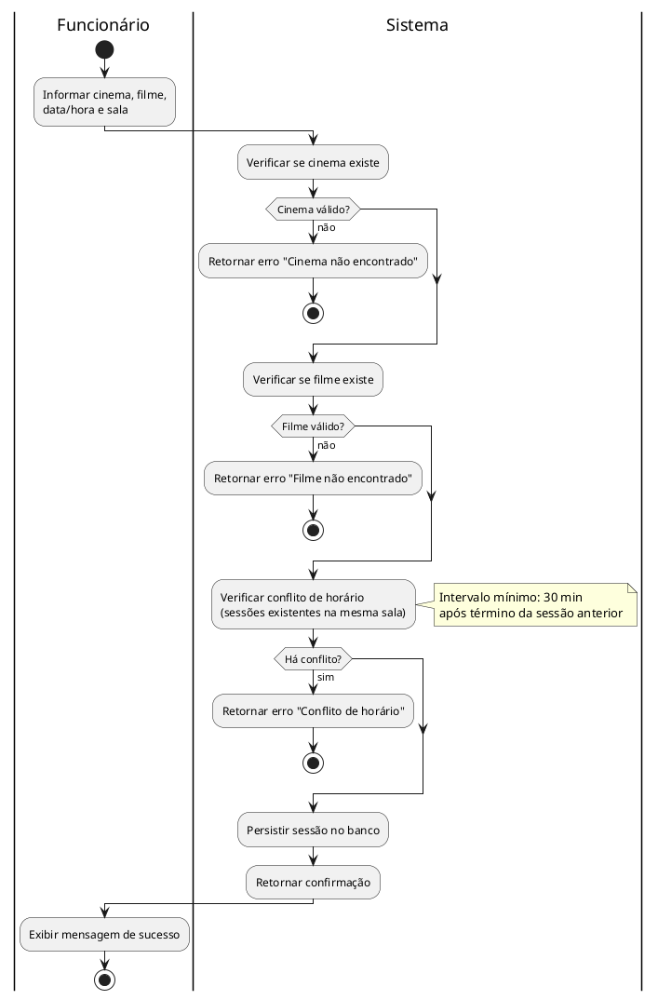
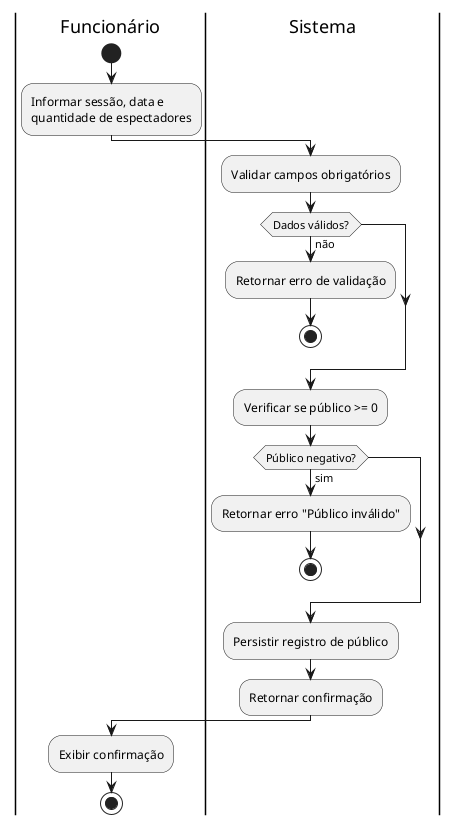
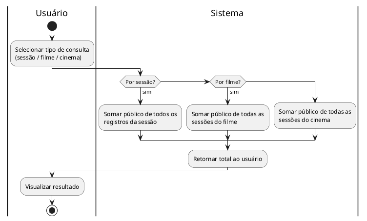

# Diagramas de Atividade

## DA01 – Cadastrar Sessão

Fluxo de negócio para adicionar uma sessão, incluindo validação de conflito de horário.

---

## DA02 – Registrar Público

Fluxo para lançar o público diário de uma sessão com validações de entrada.

---

## DA03 – Consultar Totais de Público

Fluxo de consulta agregada de público, podendo ser por sessão, filme ou cinema.

